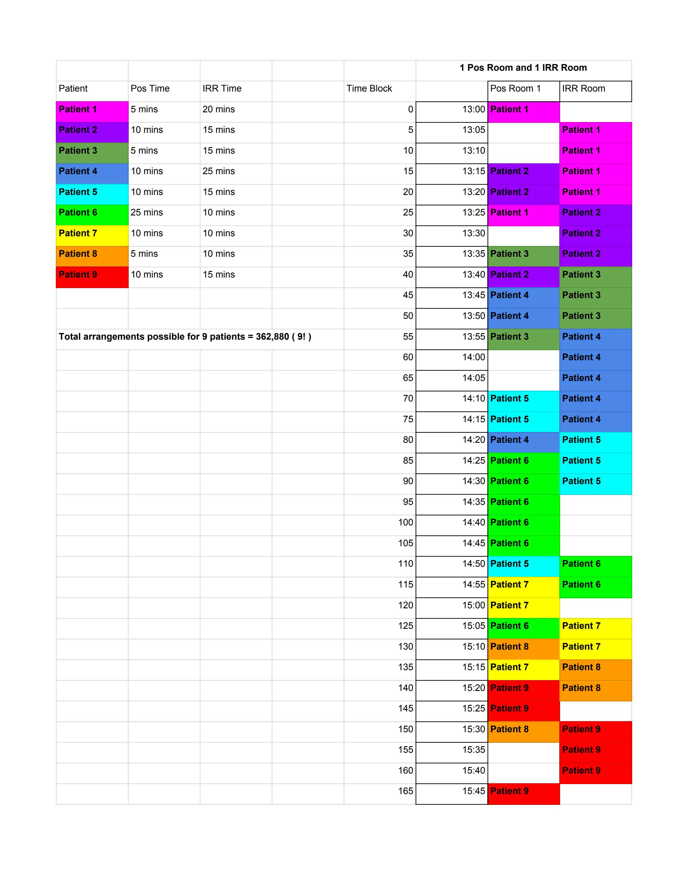

### Scheduling Patient appointments for Radiotherapy.

Current attempts at scheduling the appoints with `Job-Shop problem` OR algorithm is an incorrect approach because it assumes patients (Jobs) can leave the Positioning room (Machine 1) as soon as they finish their process (Task 1).
In reality, patients may need to stay in the Positioning room until the Irradiation room (Machine 2) is available for the next process (Task 2).

This solution tries to tackle that problem.

Desired Output:



Result Output from our program:

```
Time :   0 | Patient 1 | --------- |
Time :   5 | --------- | Patient 1 |
Time :  10 | --------- | Patient 1 |
Time :  15 | Patient 2 | Patient 1 |
Time :  20 | Patient 2 | Patient 1 |
Time :  25 | Patient 1 | Patient 2 |
Time :  30 | --------- | Patient 2 |
Time :  35 | Patient 3 | Patient 2 |
Time :  40 | Patient 2 | Patient 3 |
Time :  45 | Patient 4 | Patient 3 |
Time :  50 | Patient 4 | Patient 3 |
Time :  55 | Patient 3 | Patient 4 |
Time :  60 | --------- | Patient 4 |
Time :  65 | --------- | Patient 4 |
Time :  70 | Patient 5 | Patient 4 |
Time :  75 | Patient 5 | Patient 4 |
Time :  80 | Patient 4 | Patient 5 |
Time :  85 | Patient 6 | Patient 5 |
Time :  90 | Patient 6 | Patient 5 |
Time :  95 | Patient 6 | --------- |
Time : 100 | Patient 6 | --------- |
Time : 105 | Patient 6 | --------- |
Time : 110 | Patient 5 | Patient 6 |
Time : 115 | Patient 7 | Patient 6 |
Time : 120 | Patient 7 | --------- |
Time : 125 | Patient 6 | Patient 7 |
Time : 130 | Patient 8 | Patient 7 |
Time : 135 | Patient 7 | Patient 8 |
Time : 140 | Patient 9 | Patient 8 |
Time : 145 | Patient 9 | --------- |
Time : 150 | Patient 8 | Patient 9 |
Time : 155 | --------- | Patient 9 |
Time : 160 | --------- | Patient 9 |
Time : 165 | --------- | --------- |
```
